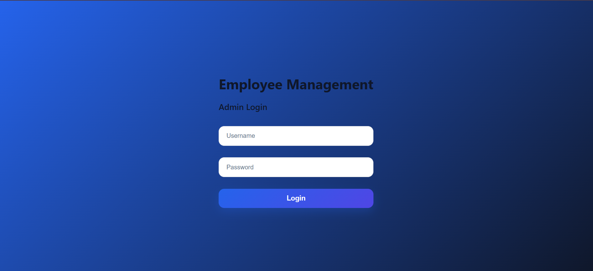
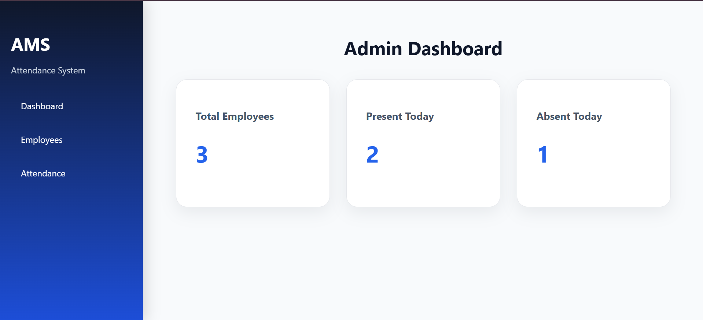
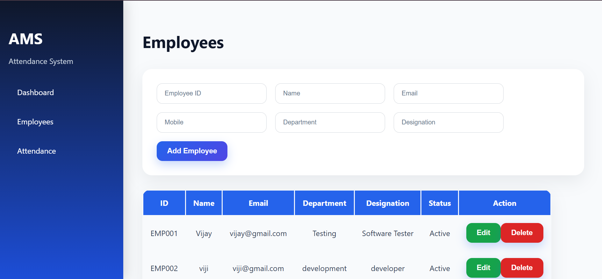
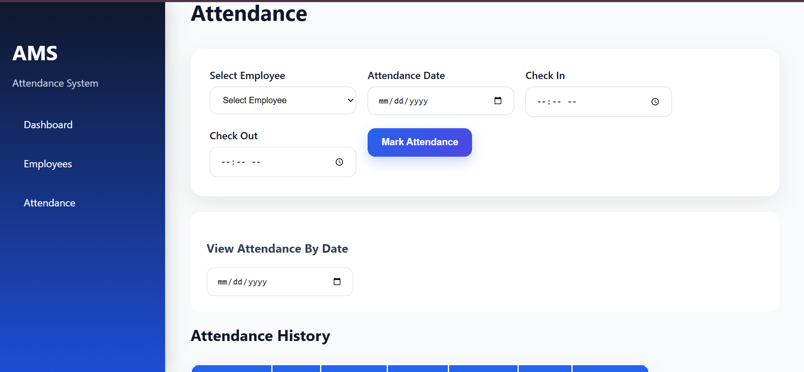

# Mini Attendance Management System

## Overview
Full-stack web application to manage employee details and attendance records.

## Tech Stack

Frontend:
- React.js
- Vite
- CSS

Backend:
- Node.js
- Express.js

Database:
- MySQL

## Features

### Authentication
- Admin login

### Employee Management
- Add employee
- View employees
- Update employee
- Delete employee

### Attendance Management
- Mark attendance
- View attendance records
- Attendance summary

### Dashboard
- Total employees
- Present today
- Absent today

## Screenshots

### Login Page

### Dashboard

### Employee Management

### Attendance Management

### Attendance History

## Database Design

Tables:

Users
- id
- username
- password

Employees
- employee_id
- name
- email
- mobile
- department
- designation
- status

Attendance
- attendance_id
- employee_id (Foreign Key)
- date
- check_in
- check_out
- status

Relationship:
Employee → Attendance
(One employee can have multiple attendance records)

## API Endpoints

Authentication:
POST /login

Employee:
POST /employees
GET /employees
PUT /employees/:id
DELETE /employees/:id

Attendance:
POST /attendance
GET /attendance

Dashboard:
GET /dashboard

## Project Structure

attendance-management-system

backend/
frontend/
README.md
.gitignore

## Setup

Backend:

cd backend

npm install

npm start

Frontend:

cd frontend

npm install

npm run dev

## Future Enhancements

- JWT Authentication
- Pagination
- Export Reports
- Swagger Documentation